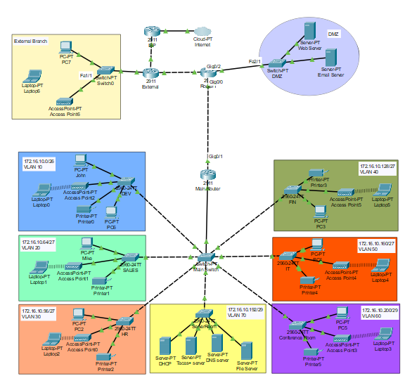

# Enterprise Network Design for Tech Zolutions Inc.

This repository contains the complete network design and implementation for Tech Zolutions Inc., a company with multiple departments. The project showcases a secure, scalable, and efficient enterprise-level network architecture created using Cisco Packet Tracer.

---

## Network Topology

The following diagram illustrates the implemented network architecture, including the internal departmental VLANs, the DMZ, the external branch, and the security boundaries.

---

## Project Files

For a detailed breakdown of the network design, configurations, and security policies, please see the project files:

- **[Report.pdf](Report.pdf)**: A comprehensive report detailing the network topology, IP addressing, VLAN configuration, security measures, and verification steps.
- **[Main.pkt](Network.pkt)**: The Cisco Packet Tracer file containing the complete, operational network topology.

---

## Project Skills and Technologies Showcase

This project demonstrates a comprehensive skill set in designing, building, and securing a modern enterprise network from the ground up. The goal was to create a robust and reliable infrastructure for a business with multiple departments, focusing on security and efficiency. Below is a summary of the key skills and technologies implemented.

### Core Network Architecture & Design

* **Network Segmentation (VLANs)**: I digitally divided the company's network into isolated zones for each department (Sales, Finance, HR, IT, Development, Server Room, and Conference Room). This is like putting up digital walls to ensure that traffic from one department doesn't spill over into another, which enhances security and improves network performance.

* **Efficient Network Routing (Router-on-a-Stick & OSPF)**: I designed a cost-effective and centralized system (router-on-a-stick) for managing data traffic between internal VLANs. Additionally, OSPF was implemented to enable dynamic routing between core routers in the wider topology, ensuring efficient path selection.

* **Automated IP Management (DHCP & Relay)**: I set up a dedicated DHCP server to automatically assign network addresses to all devices. IP helper-addresses were configured to ensure devices in all VLANs could reach the central DHCP server, streamlining management and reducing configuration errors.

* **Wireless Connectivity (WPA2-PSK)**: I deployed secure wireless access for each department, ensuring employees can connect their mobile devices safely. Each department has its own unique SSID and password (WPA2-PSK) for controlled access.

### Advanced Security Implementation

* **Multi-Layered Firewall Protection (Zones of Trust & ZBF)**: I built a robust security posture by creating three distinct security zones: a trusted **Internal** zone for employees, an untrusted **External** zone for the internet/branch, and a semi-trusted **DMZ** to safely host public-facing servers (Web and Email servers). A Zone-Based Firewall (ZBF) acts as an intelligent security guard, inspecting all traffic that moves between these zones to block threats.

* **Secure Remote Office Connectivity (Site-to-Site IPsec VPN)**: I constructed a secure, encrypted "tunnel" over the internet to connect the main office router with the external branch router. This VPN uses powerful AES-256 encryption to ensure that all data transmitted between the sites remains confidential and protected.

* **Centralized Administrator Access Control (AAA Server)**: I implemented a centralized AAA (TACACS+) server to manage who can log in and make changes to critical network equipment (routers and switches). This system ensures centralized authentication, authorization, and accounting.

* **Granular Traffic Control (Access Control Lists - ACLs)**: I wrote specific rule sets (ACLs) to control exactly what kind of traffic is allowed to flow between different network segments and security zones, enforcing departmental security policies.

---

## Technologies Utilized

- **Hardware**:
    - Cisco 2911 Integrated Services Router (ISR)
    - Cisco 2960-24TT Layer 2 Switches
    - Wireless Access Points

- **Networking & Security Protocols**:
    - VLANs & 802.1Q Trunking
    - DHCP & DHCP Relay (IP Helper-Address)
    - OSPF (Open Shortest Path First)
    - IPsec VPN (AES-256 encryption, ESP encapsulation)
    - Zone-Based Firewall (ZBF) with Stateful Inspection
    - Access Control Lists (ACLs)
    - AAA (Authentication, Authorization, and Accounting) via TACACS+
    - WPA2-PSK (Wi-Fi Protected Access 2 - Pre-Shared Key)
    - SSH (Secure Shell)

- **Simulation Software**:
    - Cisco Packet Tracer
